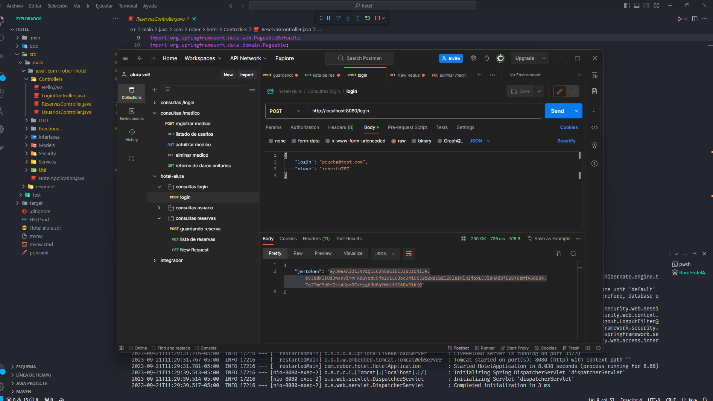
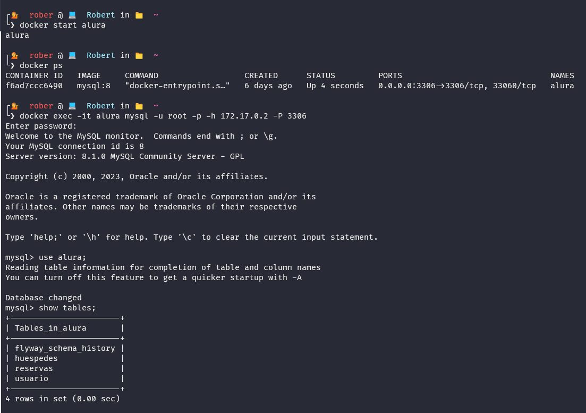
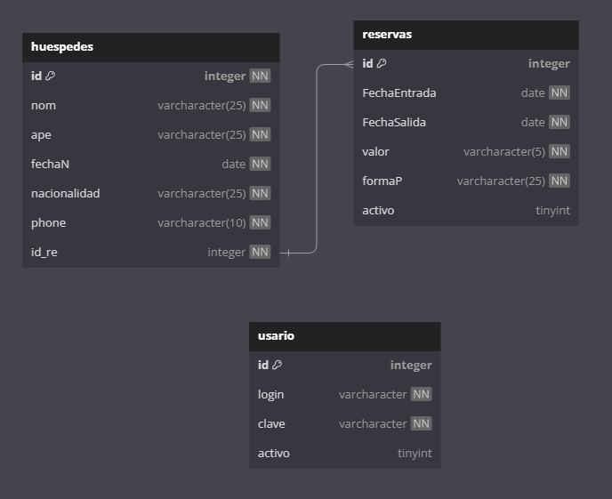

# Challenge de alura hotel

**HabitatReservas - Una Api reservas**

## Descripción

Este challenge trata de una api diseñada para simplificar y agilizar el proceso de reserva de habitaciones de hotel. Esta aplicación ha sido desarrolladaen Java, Spring, y MySQL en Docker..

## Capturas

## Características

Enumera las principales características de tu aplicación:

- Inicio de Sesión Seguro: Esta api ofrece un sistema de inicio de sesión seguro evaluando el parametros como la contraceña devolviendo un parametro q le permite al usuario relizar siertas acciones en el sistema.
- Reserva: Los usuarios pueden mediante fecha y tiene diferentes formas de pago.
- Buqueda de Reservas: sepuede ejecutar busquedas de reservas mediante el id (de momneto).
- Registro de Reservas: La aplicación registra las reservas realizadas, manteniendo un historial para cada usuario. Esto facilita la gestión y consulta de reservas anteriores.
- Automatización de pruebas: para esto se utilizo karate framework para automatizar y comprovar el funcionamiento de la api

## Tecnologías Utilizadas:

- Java 20
- MySQL 8 Database
- Postman
- Docker
- Vscode IDE para desarrollo
- Karate framework

## Docker compose

Intalación de docker:

- Se nesesita el wsl windows for system linux "esto seria la instalcion en windows"
- Documentacion de instalacion de [docker](https://docs.docker.com/desktop/install/windows-install/)
- Tutorial [Hola mundo](https://www.youtube.com/watch?v=4Dko5W96WHg&t=1161s&ab_channel=HolaMundo)

Para el lebantamiento de la base en docker tiene la documetacione [Aqui](https://hub.docker.com/_/mysql)

## Swagger Doc
 - http://localhost:8080/swagger-ui/index.html#/

## Instalación

- Clona el repositorio desde GitHub.
- Importa el proyecto en su IDE de preferencia
- Configura la base de datos MySQL y ajusta la configuración de conexión en la aplicación.
